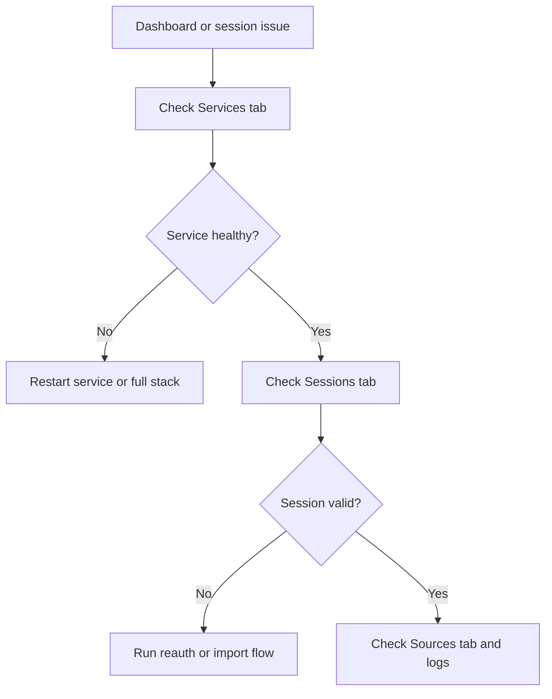

# Admin User Manual

| Field | Value |
| --- | --- |
| Document ID | UAIL-ITDASH-ADM-001 |
| Version | 1.0 |
| Status | Internal review |
| Classification | Internal |
| Owner | Tech-Unit IT |
| Last Updated | 2026-07-17 |
| Audience | Administrators and support owners |

## 1. Audience
This guide is for administrators responsible for service uptime, collector configuration, and session recovery.

## 2. Login
Browse to the admin surface:
- `http://<server>:21061/login`

Use the admin password on the admin login page.

## 3. Admin Console Layout
The admin console is organized as tabbed views:
- Overview
- Services
- Sessions
- Sources

## 4. Overview Tab
Use Overview to:
- see how many services need attention
- see whether collector sessions need renewal
- jump directly into the affected tab

## 5. Services Tab
Use Services to:
- inspect PM2 service state
- see whether each service is online, warning, error, or stopped
- run start, stop, or restart actions
- trigger a full-stack restart when needed

Typical services:
- `api-gateway`
- `dashboard-ui`
- `dashboard-frontdoor-operator`
- `dashboard-frontdoor-admin`
- `nutanix-collector`
- `solarwinds-collector`
- `symphony-collector`

## 6. Sessions Tab
Use Sessions to validate whether the stored browser-authenticated state is actually usable against the live portal.

Session states:
- `AUTH OK`
- `EXPIRED`
- `UNREACHABLE`
- `MISSING`
- `INVALID`

### 6.1 HSD Reauthentication
When HSD is expired:
- open the admin surface from the server itself if possible
- go to Sessions
- run `Launch Reauth on Server`
- complete the interactive Edge login on the Windows host
- wait for the helper to save the refreshed storage-state file

### 6.2 HSD Legacy Import
Use `Import Legacy HSD Profile` only when:
- an older authenticated Edge profile exists
- the standard interactive recovery is not the preferred path

This is an explicit recovery action, not an automatic fallback.

### 6.3 SolarWinds Session Recovery
Use the equivalent session actions for SolarWinds when the live validation shows expiry or invalid state.

## 7. Sources Tab
Use Sources to manage:
- target URLs
- collector enable or disable flags
- usernames and passwords
- poll intervals
- metadata values used by specific collectors

Current source groups:
- Nutanix primary
- SolarWinds servers
- SolarWinds networks
- Symphony primary

## 8. Server-Local Admin Behavior
Some actions are intentionally server-local:
- HSD interactive reauth
- HSD legacy-profile helper launch where applicable

If you open the admin portal from a remote client, those controls are hidden by design.

## 9. Operational Guidance

### 9.1 When A Card On The Dashboard Is Stale
Check:
1. Sessions tab for source authentication state
2. Services tab for collector process health
3. Sources tab for target URL or credential drift

### 9.2 When A Collector Is Running But Not Updating
Check:
1. the session status
2. the source endpoint configuration
3. the PM2 process logs

### 9.3 After Changing Credentials
- save the source settings
- restart the affected collector if needed
- validate that the next sync succeeds

## 10. What Admins Should Not Do
- Do not expose internal ports `3001` or `4000` to the LAN
- Do not treat expired session files as valid just because they exist
- Do not use legacy profile import as the normal HSD login path

## 11. Recovery Flow

