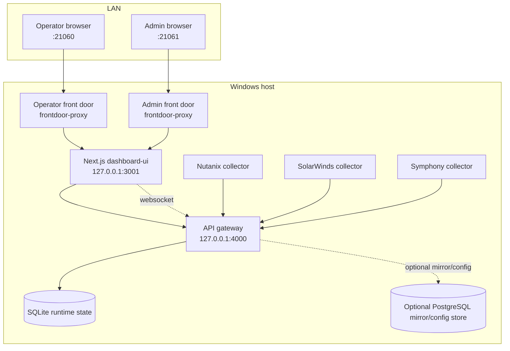
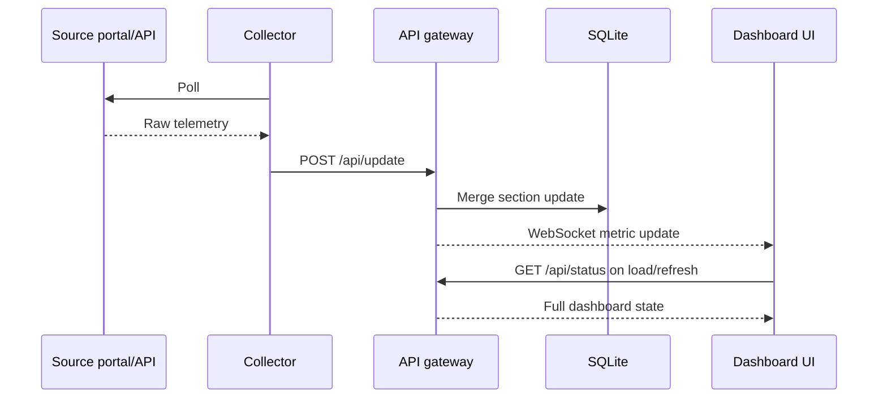
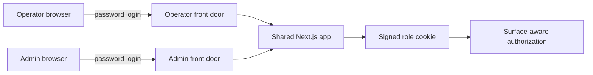

# Architecture and Design

| Field | Value |
| --- | --- |
| Document ID | UAIL-ITDASH-ADD-001 |
| Version | 1.0 |
| Status | Internal review |
| Classification | Internal |
| Owner | Tech-Unit IT |
| Last Updated | 2026-07-17 |
| Primary Reviewers | Architecture, Delivery, Operations |

## Document Intent
This document describes the implemented runtime architecture, not a hypothetical target-state redesign. Supporting future-state decisions should be raised separately against this baseline.

## 1. Current Architecture Summary
The application is a multi-process Node.js stack orchestrated by PM2. It combines direct API collection for Nutanix with headless browser collection for SolarWinds and Symphony HSD.

## 2. Runtime Topology

## 3. Service Inventory
- `dashboard-frontdoor-operator`: HTTP reverse proxy for the operator surface on `21060`
- `dashboard-frontdoor-admin`: HTTP reverse proxy for the admin surface on `21061`
- `dashboard-ui`: shared Next.js application on `127.0.0.1:3001`
- `api-gateway`: REST and WebSocket state service on `127.0.0.1:4000`
- `nutanix-collector`: direct REST polling against Prism APIs
- `solarwinds-collector`: Playwright-based collector for server and network telemetry
- `symphony-collector`: Playwright-based collector for HSD metrics

## 4. Data Flow

## 5. Collector Design

### 5.1 Nutanix Collector
- Uses direct REST calls to Prism endpoints
- Pulls cluster CPU, memory, storage, host states, and VM metrics
- Marks node states as `normal`, `warning`, `critical`, or `offline`
- Posts structured Nutanix payloads to `/api/update`

### 5.2 SolarWinds Collector
- Uses Playwright with stored session state
- Separately handles:
  - SolarWinds 45 server telemetry
  - SolarWinds 46 network telemetry
- Collects server CPU, memory, status, and host metadata
- Collects network link detail including Rx/Tx utilization and real-time traffic data
- Supports session reauth via admin actions

### 5.3 Symphony Collector
- Uses Playwright with stored authenticated state
- Scrapes live dashboard counts and queue views
- Maps queue data into:
  - incidents
  - service requests
  - work orders
  - changes
  - P1
  - P2
  - onboarding
  - security
- Supports server-local interactive reauth
- Supports explicit legacy-profile import for recovery

## 6. Gateway Design
The gateway is the operational source for dashboard state. It:
- accepts collector updates through `/api/update`
- exposes current state through `/api/status`
- exposes runtime config and runtime secrets only to loopback clients
- exposes admin settings APIs
- broadcasts change events over WebSockets
- maintains section and source freshness metadata

## 7. Storage Model

### 7.1 Primary Runtime Store
- SQLite via `better-sqlite3`
- Holds current dashboard state and section freshness
- Remains the active runtime source

### 7.2 Optional PostgreSQL Mirror
- Mirrors current dashboard state
- Stores collector target configuration
- Stores encrypted collector secrets when enabled
- Supports future operational reporting and stronger change control

## 8. Source Of Truth Rules
- Nutanix is authoritative for HCI-backed server telemetry.
- SolarWinds is authoritative for on-prem server telemetry and network telemetry.
- For overlapping server coverage, Nutanix remains primary until it is stale for more than 10 minutes.
- During fallback, the server state remains visible but is marked as SolarWinds-backed fallback.

## 9. Freshness And Failure Model
- Each section stores:
  - poll interval
  - last attempt time
  - last success time
  - last error
- UI health is derived from those section fields, not from fabricated heuristics.
- On collector failure:
  - the last synced values remain visible
  - the section pill changes state
  - the last successful sync remains inspectable

## 10. Authentication And Surface Separation

- Operator and admin run through separate front doors
- The shared Next.js app infers surface from headers set by the front door
- Operator and admin cookies are separate
- Admin-only APIs require an admin session
- HSD server-local reauth actions are visible only when the admin request originates from the host itself

## 11. UI Design Model
The operator surface is intentionally split into four domains:
- HCI
- HSD
- Network
- Servers

Design characteristics:
- large visual numerics
- small, concise data-link status pills
- color-based threshold language reused across cards
- alternate mobile layout instead of forcing the wallboard layout onto narrow screens

## 12. Threshold Language
- Green: healthy or below warning threshold
- Amber/yellow: early warning
- Orange: elevated risk or SLA below target range
- Red: critical or about-to-miss condition
- Slate/grey: offline or unavailable

## 13. Key Design Decisions
- Single deployed web app instead of separate admin desktop tooling
- Separate operator/admin ports for operational simplicity
- SQLite primary runtime state for low-friction deployment
- PostgreSQL optional for control-plane maturity
- No synthetic fallback metrics in normal operation

## 14. Technology Stack
- Node.js
- TypeScript
- Next.js
- React
- Playwright
- Express
- WebSockets
- SQLite
- Optional PostgreSQL
- PM2

## 15. Design Risks
- SolarWinds and HSD still depend on browser session longevity
- Internal HTTP remains part of the current runtime topology
- Nutanix TLS validation is intentionally relaxed because of source-system certificate constraints
- SQLite keeps the runtime simple but is not the final multi-user operational database target
