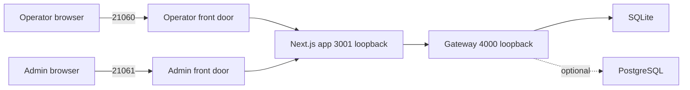
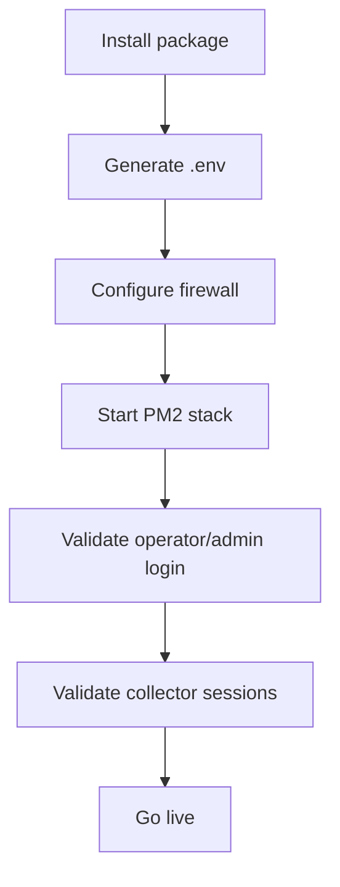

# Deployment Guide

| Field | Value |
| --- | --- |
| Document ID | UAIL-ITDASH-DEP-001 |
| Version | 1.0 |
| Status | Internal review |
| Classification | Internal |
| Owner | Tech-Unit IT |
| Last Updated | 2026-07-17 |
| Primary Audience | Infrastructure and deployment owners |

## Deployment Scope
This guide summarizes the supported deployment model and links to the packaging runbooks under `deployment/`. It is intentionally written for review and implementation planning, not as a replacement for the low-level installer scripts.

## 1. Purpose
This guide explains the supported Windows deployment model for the current application and links it to the runtime topology used by the codebase.

## 2. Deployment Model
The application is deployed as one shared web stack with two entry points:
- operator surface on `21060`
- admin surface on `21061`

Internal-only services remain on loopback:
- Next.js app on `3001`
- API gateway on `4000`

## 3. Packaging Options
- Installer: `deployment/installer/output/utkal-it-dashboard-setup.exe`
- Offline bundle: `deployment/release/utkal-it-dashboard-offline-server-bundle-2026-07-17.zip`
- Staged fallback payload: `deployment/staging/current`

For detailed packaging mechanics, keep the deployment-specific runbooks under `deployment/`.

## 4. Recommended Target Host
- Windows Server 2019 or later
- Dedicated VM or dedicated application server
- LAN reachability to Nutanix, SolarWinds, and HSD as required
- Microsoft Edge installed

## 5. Required Runtime Variables
- `APP_AUTH_SECRET`
- `APP_LOGIN_PASSWORD`
- `VIEWER_SESSION_DAYS`
- `ADMIN_SESSION_HOURS`
- `OPERATOR_FRONTDOOR_PORT`
- `ADMIN_FRONTDOOR_PORT`
- source-specific values for Nutanix, SolarWinds, and Symphony when PostgreSQL config is not fully enabled
- `POSTGRES_URL` and `POSTGRES_SECRET_PASSPHRASE` when PostgreSQL control-plane features are enabled

## 6. Deployment Topology



## 7. Installation Sequence



## 8. Standard Steps
1. Copy the installer or offline bundle to the Windows server.
2. Install to `C:\Program Files\UAIL\ITDashboard`.
3. Confirm runtime data root under `C:\ProgramData\UAIL\itdash`.
4. Configure required environment values.
5. Start the stack with PM2.
6. Validate operator and admin login pages.
7. Validate service state in the admin console.
8. Validate HSD and SolarWinds session status.

## 9. PM2 Commands

```powershell
cd C:\Program Files\UAIL\ITDashboard\app
..\runtime-tools\node_modules\.bin\pm2.cmd start ecosystem.config.js --update-env
..\runtime-tools\node_modules\.bin\pm2.cmd status
..\runtime-tools\node_modules\.bin\pm2.cmd logs
..\runtime-tools\node_modules\.bin\pm2.cmd restart ecosystem.config.js --update-env
..\runtime-tools\node_modules\.bin\pm2.cmd save
```

## 10. Firewall Rules
Allow inbound:
- TCP `21060`
- TCP `21061`

Do not expose:
- TCP `3001`
- TCP `4000`

## 11. Session Runtime Paths
- HSD storage state: `C:\ProgramData\UAIL\itdash\sessions\symphony\symphony-storage-state.json`
- HSD interactive Edge profile: `C:\ProgramData\UAIL\itdash\sessions\symphony\interactive-edge-profile`
- HSD helper scripts: `C:\ProgramData\UAIL\itdash\admin\reauth`

## 12. Validation Checklist
- Operator login works on `21060`
- Admin login works on `21061`
- Operator credentials do not grant admin access
- All expected PM2 services are online
- Dashboard sections show expected freshness status
- HSD and SolarWinds session validation shows real portal state

## 13. Operational Security Notes
- Deploy behind LAN restrictions only
- Protect runtime folders with admin-only permissions
- Keep front doors on the internal network only
- Prefer PostgreSQL encrypted secrets over long-term environment-variable secrets

## 14. Reference Runbooks
- [deployment/README.md](../deployment/README.md)
- [deployment/docs/windows_deployment_instructions_2026-07-15.md](../deployment/docs/windows_deployment_instructions_2026-07-15.md)
- [deployment/docs/offline_server_bundle_2026-07-17.md](../deployment/docs/offline_server_bundle_2026-07-17.md)
