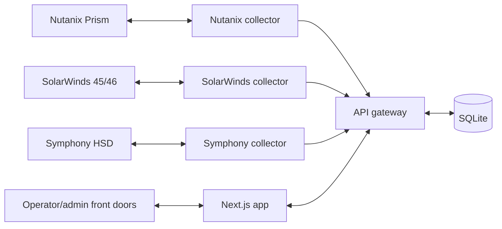

# Developer Handbook

| Field | Value |
| --- | --- |
| Document ID | UAIL-ITDASH-DEV-001 |
| Version | 1.1 |
| Status | Active baseline |
| Classification | Internal |
| Owner | Tech-Unit IT |
| Last Updated | 2026-07-19 |
| Audience | Developers, maintainers, deployment engineers |

## 1. Purpose
Provide the working handbook for developers maintaining the UAIL IT Dashboard, including repository structure, local workflows, architecture touchpoints, coding rules, documentation generation, and validation steps.

## 2. Repository Structure

| Path | Purpose |
| --- | --- |
| `api-gateway/` | central runtime state, admin APIs, WebSocket feed |
| `collectors/nutanix/` | Nutanix collector |
| `collectors/solarwinds/` | SolarWinds collector for servers and networks |
| `collectors/symphony/` | Symphony HSD collector |
| `dashboard/` | shared Next.js operator/admin UI |
| `frontdoor-proxy/` | front-door web processes |
| `deployment/` | staging, offline bundle, installer, support scripts |
| `docs/` | controlled project documentation |

## 3. Workspace Model
The project uses npm workspaces from the root package.

Main workspaces:
- `api-gateway`
- `collectors/nutanix`
- `collectors/solarwinds`
- `collectors/symphony`
- `dashboard`
- `frontdoor-proxy`

## 4. Local Development Commands

Build all workspaces:

```powershell
npm run build
```

Start the full stack with PM2:

```powershell
.\runtime\node\node.exe .\runtime-tools\node_modules\pm2\bin\pm2 start ecosystem.config.js
```

Save the PM2 process list after validation:

```powershell
.\runtime\node\node.exe .\runtime-tools\node_modules\pm2\bin\pm2 save
```

## 5. Runtime Design Summary



Key rule:
- the gateway is the operational source for merged dashboard state

## 6. Source Rules Developers Must Preserve
- never introduce fabricated fallback values for normal operation
- preserve last-success state and freshness when collection fails
- keep Nutanix authoritative for HCI-backed servers until explicit fallback conditions are met
- keep SolarWinds authoritative for network telemetry
- treat session failure as a real source failure, not as a cosmetic condition

## 7. UI Development Rules
- protect the `1920x1200` wallboard layout first
- preserve responsive fallback behavior for tablet and mobile
- prefer graphical density over unnecessary text
- keep card-level stale/error messaging concise
- do not add visual features that hide data-source or freshness truth

## 8. Collector Maintenance Notes

### 8.1 Nutanix
- direct API collector
- sensitive to source certificate constraints
- primary source for HCI-backed servers

### 8.2 SolarWinds
- Playwright-based
- session-state dependent
- handles both server and network telemetry
- preserve separate credential handling for `SW_SERVERS_*` and `SW_NETWORKS_*`

### 8.3 Symphony HSD
- Playwright-based
- session-state dependent
- supports reauthentication and explicit legacy-profile import
- uses its own `SYM_*` credentials and session state, independent from SolarWinds

## 9. Admin Surface Responsibilities
The admin surface is not just a UI add-on. It is part of the operating model and must continue to support:
- service visibility and restart control
- session validation and recovery
- source configuration
- documentation access

## 10. Documentation Workflow
The retained controlled docs are:
- Product Requirements Document
- Project Documentation and Timeline
- System Design
- User Manual
- Developer Handbook

Regenerate PDFs with:

```powershell
node docs/tools/export-markdown-pdfs.mjs
```

This writes PDFs to:
- `docs/pdf/`
- `dashboard/public/help/`

## 11. Deployment-Related Developer Notes
- deployment is SQLite-first
- PostgreSQL is not part of the supported installer path for the current release baseline
- PM2 is the current supervision model
- offline bundle generation remains important for Windows server deployment
- documentation changes that affect operations should also be reflected in the admin Help PDF set
- when bootstrap behavior changes, validate all three paths: source repo, offline bundle, and rebuilt installer artifact

## 12. Validation Checklist For Changes

### 12.1 Code Changes
- `npm run build`
- validate the affected workflow live where possible
- confirm no source-of-truth rule was broken

### 12.2 Documentation Changes
- regenerate PDFs
- verify Help tab references still match generated filenames
- check screenshot-heavy PDFs for print layout issues

### 12.3 Deployment Changes
- refresh staged payload when required
- validate the offline deployment path
- confirm the stack still boots and recovers under PM2

## 13. Common Pitfalls
- assuming a portal session file is valid without live validation
- masking stale data as current data
- changing deployment docs without updating admin Help artifacts
- tuning mobile layout in a way that regresses the primary wallboard layout

## 14. Maintainer Principle
The project should remain operationally honest before it becomes feature-rich. If a change improves visual appeal but weakens data trust, source traceability, or recovery clarity, it is the wrong change.
