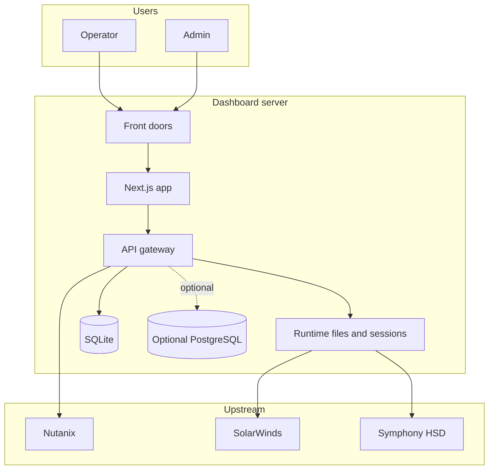
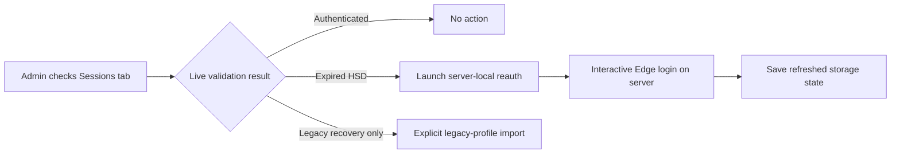

# Information Security

| Field | Value |
| --- | --- |
| Document ID | UAIL-ITDASH-IS-001 |
| Version | 1.0 |
| Status | Internal review |
| Classification | Internal |
| Owner | Tech-Unit IT |
| Last Updated | 2026-07-19 |
| Primary Reviewers | Information Security, Infrastructure, Operations |

## Review Position
This document records the current posture and compensating controls for the implemented application. It should be used as a review baseline for ISMS discussion, not as a claim that all target-state security controls are already complete.

## 1. Objective
Document the current security posture of the UAIL IT Dashboard, the controls already present, and the compensating controls required for enterprise deployment and ISMS review.

## 2. Security Scope
In scope:
- operator and admin web access
- front-door proxies
- gateway APIs
- collector credentials and sessions
- SQLite runtime state
- optional PostgreSQL config and secret storage
- Windows server deployment model

Out of scope:
- hardening of the upstream enterprise systems themselves
- corporate identity platform configuration beyond current local auth constraints

## 3. Trust Boundaries

## 4. Current Security Model

### 4.1 Access Control
- Separate operator and admin ports
- Separate signed cookies for operator and admin surfaces
- Admin-only API routes protected in the Next.js layer
- Local fixed usernames per surface:
  - `operator`
  - `admin`
- Shared password configured through `APP_LOGIN_PASSWORD`

### 4.2 Network Exposure
- Only `21060` and `21061` should be exposed on the LAN
- `3001` and `4000` are intended to remain loopback only
- Collector runtime config and secret endpoints enforce loopback access

### 4.3 Secret Handling
- Current bootstrap supports an encrypted local collector settings store under the shared runtime root
- The preferred passphrase variable is `SECRET_STORE_PASSPHRASE`
- Current bootstrap still supports environment-variable secrets as a fallback
- PostgreSQL can still store mirrored secrets when `POSTGRES_URL` is configured
- Secret encryption uses AES-256-GCM with scrypt-derived keys

### 4.4 Session Handling
- SolarWinds and HSD collectors use Playwright storage-state files
- HSD also uses a persistent interactive Edge profile for reauthentication
- Session recovery is an admin operation
- HSD reauth is intentionally limited to server-local admin sessions

## 5. Known Security Gaps
- Local password-only login is simpler than enterprise SSO
- `/api/update` accepts collector payloads without a second application-layer secret, relying on deployment topology instead
- Front-door traffic is HTTP unless protected by network controls or a reverse proxy/TLS terminator
- Nutanix TLS certificate validation is disabled because of the upstream certificate state
- Runtime session files exist on disk by design
- SQLite provides limited auditability compared with a full transactional operational database

## 6. Compensating Controls Required Today
- Deploy on a dedicated Windows server or VM
- Restrict inbound access to `21060` and `21061` to approved plant/LAN segments
- Do not expose the application to the public internet
- Block direct external access to ports `3001` and `4000`
- Restrict local server logon rights to administrators
- Protect `C:\ProgramData\UAIL\ITDashboard` with admin-only filesystem ACLs
- Use a dedicated service account for upstream portal access
- Backup runtime config and session-state locations securely

## 7. Recommended Hardening Roadmap

### Phase 1. Immediate
- Move production collector secrets out of plain `.env` values into the encrypted local collector settings store
- Keep application services on the dedicated server only
- Restrict LAN access by Windows Firewall and network ACL
- Rotate `APP_AUTH_SECRET` and use a long random value
- Rotate the shared local password after deployment

### Phase 2. Short Term
- Replace shared password login with per-user accounts or enterprise-auth integration
- Add proper write audit trails for admin settings changes
- Add request authentication or stronger isolation for `/api/update`
- Place the front doors behind TLS termination on the server or an internal reverse proxy

### Phase 3. Medium Term
- Add auditable write trails if the deployment later requires multi-user configuration history
- Replace browser-dependent HSD collection with API-based access if the enterprise endpoint becomes available
- Reduce reliance on disk-stored browser sessions

## 8. Deployment Control Checklist
- Server patched and hardened
- Edge installed and updated
- Only approved users have access to the server
- Firewall rules limited to approved operator/admin ports
- Loopback-only internal services validated
- Strong `APP_AUTH_SECRET` configured
- Strong `SECRET_STORE_PASSPHRASE` configured
- Runtime directories ACL-hardened
- Backup and restore procedure documented

## 9. Operational Handling Of Expired Sessions

## 10. Data Classification Guidance
- Dashboard metrics: internal operational data
- Collector credentials: confidential
- Session cookies/storage state: confidential authentication material
- Infrastructure hostnames and availability states: internal

## 11. ISMS Position
The application can be defended in an ISMS review if it is positioned as an internal, dedicated-server operational dashboard with documented compensating controls. The current posture is acceptable only when:
- hosted on a controlled internal server
- restricted to LAN users
- protected by host/network controls
- supported by documented admin procedures for session recovery and secret handling
