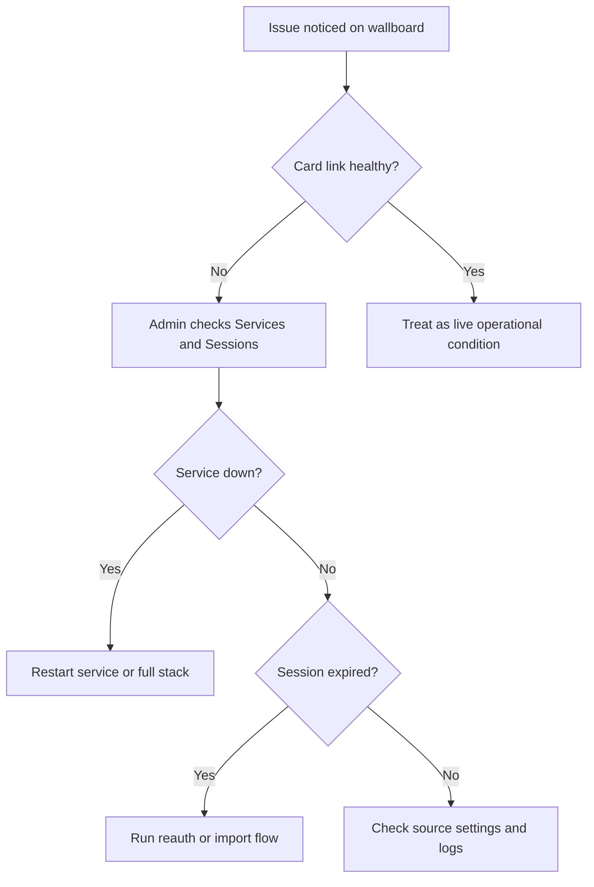

# Operations Guide

| Field | Value |
| --- | --- |
| Document ID | UAIL-ITDASH-OPS-ADM-001 |
| Version | 1.1 |
| Status | Internal review |
| Classification | Internal |
| Owner | Tech-Unit IT |
| Last Updated | 2026-07-19 |
| Audience | Operators, supervisors, administrators |

## 1. Purpose
This guide combines the earlier operator and admin manuals into one practical runtime guide for daily use, troubleshooting, and service recovery.

## 2. Access Points

| Surface | URL Pattern | Login Expectation |
| --- | --- | --- |
| Operator | `http://<server>:21060/login` | Operator password only |
| Admin | `http://<server>:21061/login` | Admin password only |

## 3. Operator Workflow

### 3.1 What Operators Monitor
- HCI cluster metrics
- Hindalco Service Desk workload and SLA
- network carrier and SDWAN links
- server fleet health

### 3.2 How To Read Card Link Status
- `OK`: collector is updating normally
- `STALE`: last success is older than expected
- `ERROR`: collector attempted refresh and failed
- `NEVER`: no successful sync has been recorded

Operational rule:
- if the link status is not healthy, treat the visible values as last-synced values rather than current live values

### 3.3 Color Language
- green: healthy or within threshold
- amber: early warning
- orange: elevated concern or SLA below target band
- red: critical or about to miss
- slate: offline or unavailable

### 3.4 Operator Filters
The operator surface supports show/hide filtering for:
- sections: HCI, HSD, Network, Servers
- server status: normal, warning, critical, offline
- server platform: HCI VM, On Prem
- server OS: Windows, Linux
- server source: Nutanix, SW45, fallback
- network carriers and paths
- HSD work types and special queues

### 3.5 Mobile And Portrait Use
Narrow screens use a stacked layout intended for monitoring and quick inspection. The wallboard layout on `1920x1200` remains the primary presentation target.

## 4. Admin Workflow

### 4.1 Admin Console Areas
- `Overview`: quick health view and top-level actions
- `Services`: PM2-backed run state and control actions
- `Sessions`: HSD and SolarWinds session validation, reauth, and imports
- `Sources`: collector URLs, enable flags, usernames, passwords, and metadata
- `Help`: embedded PDF document set

### 4.2 Services Tab
Use `Services` to:
- inspect process state
- confirm health summaries
- start, stop, or restart specific services
- restart the full stack when the issue is cross-service

Expected services:
- `api-gateway`
- `dashboard-ui`
- `dashboard-frontdoor-operator`
- `dashboard-frontdoor-admin`
- `nutanix-collector`
- `solarwinds-collector`
- `symphony-collector`

### 4.3 Sessions Tab
Use `Sessions` to validate that saved browser state is still accepted by the live portals.

Typical states:
- `AUTH OK`
- `EXPIRED`
- `UNREACHABLE`
- `MISSING`
- `INVALID`

### 4.4 HSD Recovery
When HSD is expired:
1. Open the admin surface from the server itself if possible.
2. Go to `Sessions`.
3. Launch HSD reauthentication on the server.
4. Complete the interactive Edge login and wait for the refreshed storage-state file to be saved.

Use legacy-profile import only as an explicit recovery path when an older authenticated Edge profile already exists and must be migrated.

### 4.5 SolarWinds Recovery
When SolarWinds validation shows expiry or invalid state:
1. Go to `Sessions`.
2. Run the SolarWinds reauthentication helper.
3. Complete the browser login flow.
4. Revalidate the session snapshot.

### 4.6 Sources Tab
Use `Sources` to manage:
- enable or disable state
- target URLs
- usernames and passwords
- poll intervals
- source-specific metadata and notes

Current managed targets:
- Nutanix primary
- SolarWinds servers
- SolarWinds networks
- Symphony primary

## 5. Incident Handling

### 5.1 If A Dashboard Card Looks Wrong
1. Check the card data-link status.
2. If stale or erroring, treat values as last-synced.
3. If healthy but abnormal, treat it as a live operational condition.
4. Escalate collector or session problems to an admin.

### 5.2 If A Collector Stops Updating
1. Check `Services`.
2. Check `Sessions` for expiry or invalid state.
3. Check `Sources` for configuration drift.
4. Restart the affected collector only if the root cause is understood or after credentials are corrected.

### 5.3 After Credential Changes
1. Save the updated settings.
2. Restart the affected collector if required.
3. Validate the next sync and check the card link state.

## 6. Recovery Flow

## 7. Do And Do Not

Do:
- keep operator use focused on monitoring and filters
- use admin actions only from authorized accounts
- treat session expiry as a source availability issue
- keep internal services on loopback

Do not:
- expose `3001` or `4000` to the LAN
- assume session files are valid just because they exist
- use legacy HSD import as the normal login path
- treat fallback telemetry as primary source telemetry
