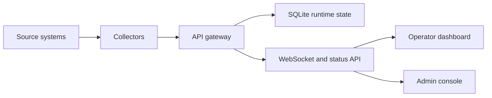

# Product Requirements Specification

| Field | Value |
| --- | --- |
| Document ID | UAIL-ITDASH-PRS-001 |
| Version | 1.0 |
| Status | Internal review |
| Classification | Internal |
| Owner | Tech-Unit IT |
| Last Updated | 2026-07-17 |
| Primary Reviewers | Operations, Infrastructure, Delivery |

## Approval and Review

| Role | Name | Status |
| --- | --- | --- |
| Business Owner | TBD | Pending |
| Technical Owner | Tech-Unit IT | Drafted |
| Information Security Reviewer | TBD | Pending |

## 1. Purpose
Deliver a production-ready engineering wallboard for UAIL IT operations that shows live, trustworthy status from core operational systems without requiring operators to cross-check multiple portals.

## 2. Product Summary
The product is a LAN-hosted dashboard with:
- an operator surface for live monitoring
- an admin surface for service control, collector configuration, and session recovery
- collectors for Nutanix, SolarWinds, and Symphony HSD
- a gateway that normalizes collector updates into a single runtime state

## 3. Primary Users
- Operations team members watching the wallboard continuously
- IT leads validating service health, backlog, and infrastructure status
- Admin users maintaining source configuration and collector sessions

## 4. Business Goals
- Reduce time to understand overall IT health
- Show cross-domain status on one screen
- Preserve trust by avoiding fabricated values
- Make collector/session recovery operationally manageable
- Support installation on an offline or restricted Windows server

## 5. Product Principles
- Show only real values from a known source
- Preserve the last synced data when a collector fails
- Make data freshness visible at section level
- Keep the operator view simple and graphical
- Keep the admin view practical and service-oriented

## 6. Functional Scope

### 6.1 Operator Dashboard
The operator surface shall:
- render a one-page engineering wallboard optimized for `1920x1200`
- show HCI, HSD, network, and server sections
- display current section data-link health and last successful sync
- support live updates from the gateway status API and WebSocket feed
- provide operator filters to show and hide sections and data categories
- present a mobile or portrait-friendly responsive layout on smaller screens

### 6.2 HCI Monitoring
The dashboard shall:
- display live Nutanix cluster metrics
- show node count and per-node visual state
- show CPU, memory, and storage utilization
- use threshold-driven coloring for utilization indicators

### 6.3 HSD Monitoring
The dashboard shall:
- display open incidents, service requests, work orders, and changes
- show status bucket breakdowns for `new`, `assigned`, `in progress`, and `pending`
- show SLA performance widgets
- expose special queues for `P1`, `P2`, onboarding, and security
- preserve last synced values with freshness indicators when the collector cannot refresh

### 6.4 Network Monitoring
The dashboard shall:
- display live SolarWinds network telemetry
- emphasize the monitored ISP and SDWAN links
- show real-time and daily utilization as sparklines
- show Rx and Tx values explicitly
- show link state in a compact, engineering-focused style

### 6.5 Server Monitoring
The dashboard shall:
- display server telemetry with grouping by platform and OS family
- identify HCI VM vs on-prem
- identify Windows vs Linux
- color-code server state as normal, warning, critical, or offline
- expose source attribution and fallback state

### 6.6 Source Of Truth And Fallback
The system shall:
- use Nutanix as source of truth for servers present in both Nutanix and SolarWinds
- use SolarWinds as source of truth for on-prem servers
- use SolarWinds fallback for Nutanix-backed servers only after Nutanix is stale for more than 10 minutes and SolarWinds telemetry exists
- never invent synthetic values during normal operation

### 6.7 Admin Surface
The admin surface shall:
- expose service health and process control
- expose session validation and recovery
- expose collector target URL and credential settings
- keep HSD reauthentication server-local
- allow explicit HSD legacy-profile import as a recovery action

### 6.8 Authentication
The product shall:
- expose separate operator and admin login surfaces
- use password-only local login with fixed usernames per surface
- maintain signed web sessions with separate cookie scopes for operator and admin

## 7. Non-Functional Requirements

### 7.1 Performance
- Initial operator page load should remain usable on the plant LAN
- Collector polling should remain aligned with source cadence:
  - Nutanix: 30 seconds
  - SolarWinds servers/networks: 30 seconds
  - Symphony HSD: 60 seconds

### 7.2 Reliability
- The wallboard shall continue rendering the last successful values when a collector fails
- Data-link status shall indicate `ok`, `stale`, `error`, or `never`
- Admin users shall be able to restart services and inspect session state without logging into the Windows host shell

### 7.3 Security
- Internal application services shall stay on loopback where possible
- Only the operator and admin front doors shall bind to LAN interfaces
- Runtime secrets shall support migration from environment variables to encrypted PostgreSQL storage

### 7.4 Deployability
- The product shall be deployable on a Windows server
- It shall support offline or low-connectivity installation
- It shall run under PM2 with a consistent process model

## 8. User Experience Requirements
- The operator surface shall prioritize large graphical metrics over dense text
- The wallboard shall remain readable from a distance
- Error messages shall be concise and section-local
- Portrait/mobile layout shall avoid overlapping cards

## 9. Constraints
- Nutanix is currently accessed with self-signed or expired internal TLS certificates
- SolarWinds and HSD currently depend on browser-authenticated collector sessions
- Some source systems are only available over internal HTTP or non-ideal TLS

## 10. Acceptance Criteria
- Operators can log into `21060` and see all enabled sections
- Admins can log into `21061` and control services and sessions
- Section health reflects the real last-success state from collectors
- Nutanix-backed servers stay on Nutanix unless fallback conditions are met
- Network data comes from SolarWinds 46
- HSD values map correctly to bucketed statuses and visible special queues
- The dashboard remains usable on the primary wallboard resolution

## 11. Product Flow

