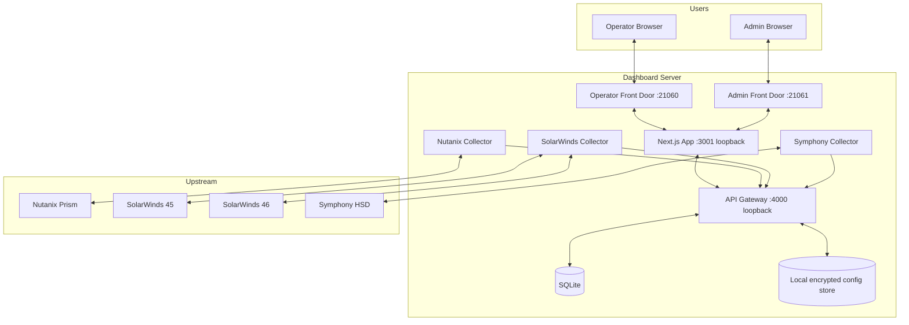
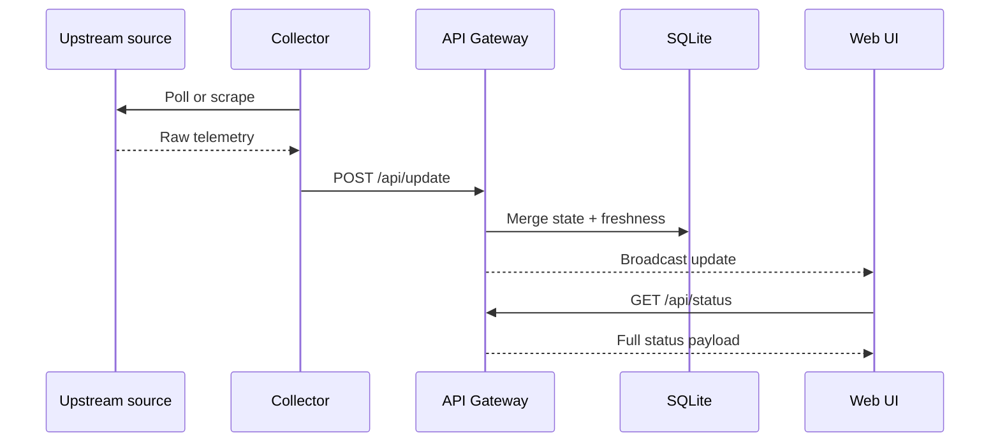
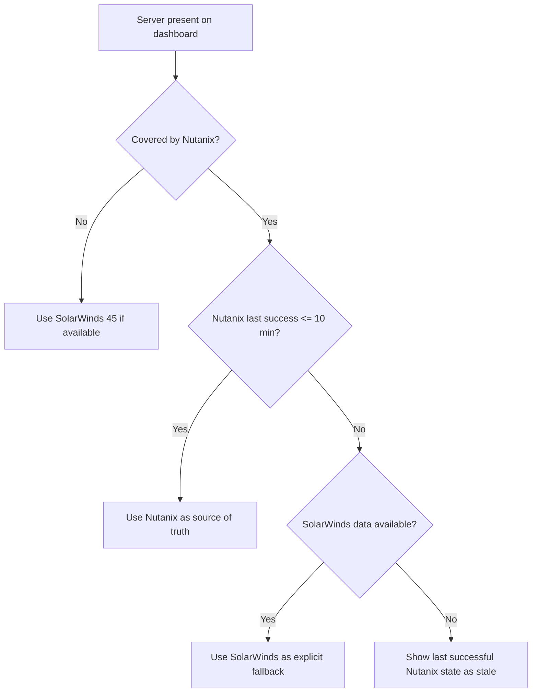
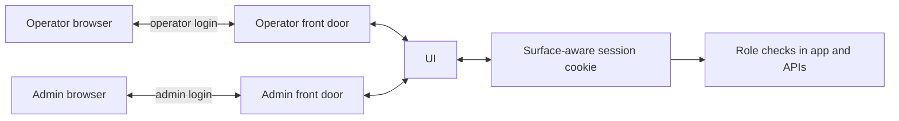
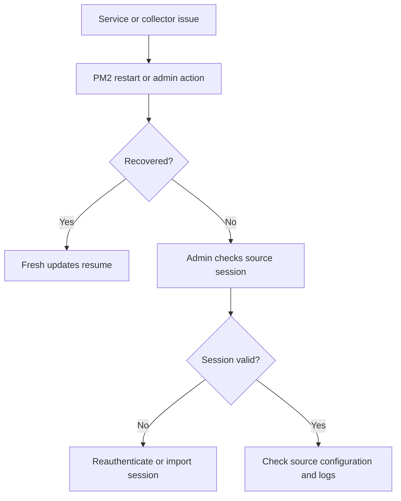

# System Design

| Field | Value |
| --- | --- |
| Document ID | UAIL-ITDASH-SDD-001 |
| Version | 1.1 |
| Status | Active baseline |
| Classification | Internal |
| Owner | Tech-Unit IT |
| Last Updated | 2026-07-24 |
| Audience | Architects, developers, infrastructure, reviewers |

## 1. Purpose
Describe the implemented runtime architecture, trust boundaries, data flow, deployment topology, and recovery model for the UAIL IT Dashboard.

## 2. System Context
The system is a multi-process Node.js application deployed on a Windows host. It presents separate operator and admin surfaces while sharing the same internal application stack.

## 3. Runtime Components

| Component | Purpose | Exposure |
| --- | --- | --- |
| `dashboard-frontdoor-operator` | Reverse proxy and operator surface identity | LAN |
| `dashboard-frontdoor-admin` | Reverse proxy and admin surface identity | LAN |
| `dashboard-ui` | Shared Next.js web app | Loopback |
| `api-gateway` | REST API, WebSocket broadcast, admin endpoints | Loopback |
| `nutanix-collector` | Direct Nutanix API polling | Host-local |
| `solarwinds-collector` | SolarWinds portal scraping for servers and networks with independently configured portal credentials | Host-local |
| `symphony-collector` | Symphony HSD portal scraping | Host-local |

## 4. Data Flow

## 5. Dashboard Domains

### 5.1 HCI Domain
- Source: Nutanix
- Primary content: cluster CPU, memory, storage, node state
- Trust rule: Nutanix-only

### 5.2 HSD Domain
- Source: Symphony HSD
- Primary content: open work items, SLA posture, special queues
- Trust rule: last-success state remains visible if collection fails

### 5.3 Network Domain
- Source: SolarWinds 46
- Primary content: carrier and SDWAN state, Tx/Rx, sparklines
- Trust rule: SolarWinds 46 is authoritative

### 5.4 Server Domain
- Primary sources:
  - Nutanix for HCI-backed servers
  - SolarWinds 45 for on-prem servers
- Fallback rule:
  - for overlapping coverage, Nutanix remains primary
  - SolarWinds is used only after Nutanix is stale for more than 10 minutes and SolarWinds data exists

## 6. Source Of Truth Decision Flow

## 7. Freshness And Failure Model
Each section is represented with operational freshness metadata:
- poll interval
- last attempt time
- last success time
- last error

The UI uses this data to derive link state and staleness messaging. The dashboard does not fabricate values; it reuses the last confirmed values and makes the freshness visible.

## 8. Storage Model

### 8.1 Primary Runtime Store
- SQLite
- current merged dashboard state
- freshness and error state

### 8.2 Local Config And Secrets
- runtime config and secrets stored under the shared runtime root
- encrypted local secret handling supported through the configured secret-store passphrase
- installer and bootstrap paths maintain separate credentials for Nutanix, SolarWinds 45, SolarWinds 46, and HSD

### 8.3 Local Audit Trail
- admin and authentication audit records are stored as append-only JSONL files under `C:\ProgramData\UAIL\ITDashboard\audit`
- the admin Audit lane and export actions read from this local store
- this audit path is independent of PostgreSQL and is part of the supported baseline

### 8.4 Optional Extensions
- PostgreSQL-related source code remains in the repository for future maturity work
- PostgreSQL is not part of the supported installer or deployment baseline for the current release

## 9. Authentication And Surface Separation

- operator and admin surfaces have different login prompts
- both surfaces share the same Next.js application
- the surface determines the expected role and cookie namespace
- admin APIs are restricted to admin sessions

## 10. Deployment Design

| Item | Value |
| --- | --- |
| Primary host model | Dedicated Windows server or VM |
| Operator port | `21060` |
| Admin port | `21061` |
| Internal UI port | `3001` loopback |
| Internal gateway port | `4000` loopback |
| Process manager | PM2 |
| Runtime store | SQLite |
| Audit store | Local append-only JSONL files under runtime root |

Bootstrap expectations:
- installer and staged deployment prompt separately for SolarWinds 45 credentials, SolarWinds 46 credentials, and HSD credentials
- generated runtime configuration uses `SW_SERVERS_*`, `SW_NETWORKS_*`, and `SYM_*` variables rather than assuming a shared portal identity

## 11. Auto-Heal And Recovery

Auto-heal mechanisms:
- PM2 process supervision
- saved process list via `pm2 save`
- Windows startup recovery via a SYSTEM scheduled task that reruns the bundled PM2 bootstrap
- runtime permission repair for PM2 state, session files, logs, config, and app data before bootstrap
- admin-triggered restart actions
- browser wake-lock request on the operator surface when the browser supports secure-context screen wake lock

Screen-display note:
- the operator UI attempts to keep the screen awake through the browser when supported
- Windows lock-screen, screensaver, or group-policy enforcement can still override browser behavior, so dedicated wallboard machines should still be configured appropriately at the OS level

## 12. Security Boundaries
- only the two front-door ports should be LAN-exposed
- UI and gateway remain loopback-only
- source credentials and session state are sensitive operational assets
- the dashboard is intended for internal network deployment only

## 13. Key Constraints
- Nutanix TLS verification is relaxed because of upstream certificate conditions
- HSD and SolarWinds depend on browser-authenticated sessions
- current authentication is practical and local, not enterprise SSO

## 14. Design Principles
- show only real data from a trusted source
- make freshness explicit
- prefer operational simplicity over avoidable platform complexity
- keep admin operations available through the web surface rather than requiring shell access for normal recovery
