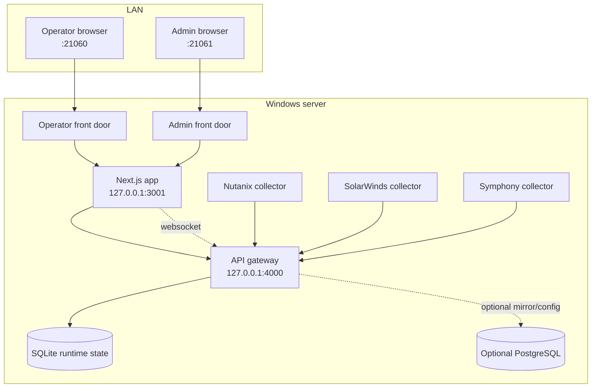
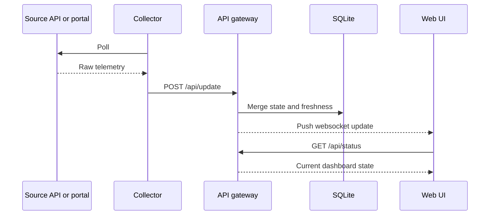

# System Handbook

| Field | Value |
| --- | --- |
| Document ID | UAIL-ITDASH-SYS-001 |
| Version | 1.1 |
| Status | Internal review |
| Classification | Internal |
| Owner | Tech-Unit IT |
| Last Updated | 2026-07-19 |
| Audience | Operations, infrastructure, delivery, information security |

## 1. Purpose
This handbook is the primary technical and operational baseline for the UAIL IT Dashboard. It replaces the earlier split across requirements, architecture, security, and deployment notes with one maintained source that matches the current implementation.

## 2. Product Summary
The UAIL IT Dashboard is an internal LAN-hosted operational wallboard with:
- an operator surface on `21060`
- an admin surface on `21061`
- a shared Next.js app
- a loopback API gateway
- collectors for Nutanix, SolarWinds, and Symphony HSD
- SQLite as the active runtime store
- optional PostgreSQL for mirror and control-plane use

The system is designed around one rule: show only real values from a known source, and keep the last confirmed values visible with their last sync time when a source fails.

## 3. Users And Surfaces

| Surface | Port | Primary Users | Purpose |
| --- | --- | --- | --- |
| Operator | `21060` | Operations wallboard viewers | Live monitoring, filtering, drill-free situational awareness |
| Admin | `21061` | Tech-Unit IT admins | Service control, source configuration, session recovery, documentation access |

Both surfaces use the same web application and differ by front-door routing, login flow, and authorization.

## 4. Runtime Topology



## 5. Functional Scope

### 5.1 Operator Dashboard
The operator dashboard presents:
- HCI cluster metrics
- HSD backlog and SLA metrics
- network link status and utilization
- server fleet status by platform and OS

Design priorities:
- one-page wallboard for `1920x1200`
- usable secondary layout for `1920x1080`
- responsive mobile and portrait fallback without overlapping cards
- concise data-link status per card or section

### 5.2 Admin Console
The admin console provides:
- PM2-backed service state and restart controls
- live HSD and SolarWinds session validation
- server-local HSD reauthentication and legacy-profile import where applicable
- source endpoint and credential settings
- embedded help/documentation PDFs

## 6. Data Sources And Source Of Truth

| Domain | Primary Source | Notes |
| --- | --- | --- |
| HCI cluster | Nutanix | Direct Prism API polling |
| HCI-backed servers | Nutanix | Primary source whenever Nutanix is healthy |
| On-prem servers | SolarWinds 45 | Used for non-HCI server telemetry |
| Network links | SolarWinds 46 | Used for carrier and SDWAN telemetry |
| HSD backlog and SLA | Symphony HSD | Browser-authenticated collector |

### 6.1 Overlap Rule
- Nutanix is authoritative for any server present in both Nutanix and SolarWinds.
- SolarWinds becomes fallback for Nutanix-backed servers only after Nutanix has been stale for more than 10 minutes and SolarWinds telemetry exists.
- During fallback, the UI must indicate the fallback source rather than presenting the value as if it were still Nutanix-derived.

### 6.2 Failure Rule
- The dashboard must not fabricate normal operating values.
- On collection failure, keep the last successful values visible.
- Show the last synced time and collector/link state for the affected section.

## 7. Service Inventory

| Service | Role | Exposure |
| --- | --- | --- |
| `dashboard-frontdoor-operator` | Operator reverse proxy | LAN |
| `dashboard-frontdoor-admin` | Admin reverse proxy | LAN |
| `dashboard-ui` | Shared Next.js app | Loopback |
| `api-gateway` | Status API, admin APIs, WebSocket feed | Loopback |
| `nutanix-collector` | Nutanix polling | Host-local |
| `solarwinds-collector` | SolarWinds 45/46 Playwright collection | Host-local |
| `symphony-collector` | Symphony HSD Playwright collection | Host-local |

## 8. Collection And Storage Model



Current storage posture:
- SQLite is the active runtime state store.
- PostgreSQL is optional and used only when explicitly configured for mirrored state or stronger control-plane storage.
- Collector target settings and secrets can be stored in the encrypted local runtime store when PostgreSQL is not enabled.

## 9. Reliability Model

### 9.1 Freshness Metadata
Each major section tracks:
- poll interval
- last attempt
- last success
- last error

### 9.2 Auto-Heal Model
Deployed recovery is based on:
- PM2 restart behavior for crashed services
- `pm2 save`
- startup restore via scheduled task and `pm2 resurrect`
- admin service controls for targeted restarts

### 9.3 Session-Dependent Sources
SolarWinds and HSD still depend on browser-authenticated sessions. Admin users must treat expired sessions as a source failure, not as a UI-only issue.

## 10. Deployment Baseline

### 10.1 Supported Host
- Windows Server 2019 or later
- dedicated VM or dedicated application server
- Edge installed
- LAN reachability to Nutanix, SolarWinds, and HSD

### 10.2 Packaging Paths
- Installer: `deployment/installer/output/utkal-it-dashboard-setup.exe`
- Offline bundle: `deployment/release/utkal-it-dashboard-offline-server-bundle-2026-07-19.zip`
- Staged fallback payload: `deployment/staging/current`

### 10.3 Core Runtime Paths
- install/runtime root: `C:\ProgramData\UAIL\ITDashboard`
- HSD storage state: `C:\ProgramData\UAIL\ITDashboard\sessions\symphony\symphony-storage-state.json`
- HSD interactive Edge profile: `C:\ProgramData\UAIL\ITDashboard\sessions\symphony\interactive-edge-profile`
- local collector settings: `C:\ProgramData\UAIL\ITDashboard\config\collector-settings.json`

### 10.4 Deployment Validation
Run the packaged smoke test after staging or installer rebuilds:

```powershell
powershell -NoProfile -ExecutionPolicy Bypass -File deployment\tools\validate-offline-deployment.ps1
```

This provisions an isolated temporary install, starts the stack on `22160` and `22161`, validates the operator and admin login flows, checks the admin services API, and tears the test install back down.

## 11. Security Posture

### 11.1 Current Controls
- separate operator and admin front doors
- separate signed cookies for operator and admin sessions
- admin-only APIs protected in the Next.js layer
- loopback restriction for internal services and runtime config endpoints
- encrypted local secret store supported via `SECRET_STORE_PASSPHRASE`

### 11.2 Known Gaps
- local password-only login is simpler than enterprise SSO
- `/api/update` still relies on host and network isolation rather than a dedicated application-layer collector key
- front-door traffic is HTTP unless network controls or TLS termination are added outside the app
- Nutanix TLS verification is disabled because of upstream certificate conditions
- SolarWinds and HSD session material remains on disk by design

### 11.3 Required Compensating Controls
- deploy on a dedicated internal Windows server or VM
- expose only `21060` and `21061` on approved internal segments
- keep `3001` and `4000` loopback-only
- ACL-protect `C:\ProgramData\UAIL\ITDashboard`
- use dedicated upstream service credentials
- back up runtime configuration and session-state files securely

## 12. Acceptance Baseline
The current implementation is considered aligned when:
- operators can log into `21060` and view all enabled sections
- admins can log into `21061` and manage services, sessions, and source settings
- section link state reflects real collector freshness and last-sync data
- Nutanix-backed servers revert to Nutanix when Nutanix data becomes healthy again after fallback
- network telemetry is sourced from SolarWinds 46
- HSD bucket counts and special queues reflect live portal mappings

## 13. Current Constraints
- Nutanix uses non-ideal internal TLS certificates
- SolarWinds and HSD are still browser-session dependent
- SQLite is intentionally the active store for deployment simplicity
- the local login model is acceptable only for a controlled internal deployment

## 14. Maintained References
- [Documentation Index](README.md)
- [Operations Guide](operations-guide.md)
- [Project Timeline](project-timeline-2026-07-19.md)
- [Executive Summary Pack](executive-summary-pack.md)
- [Deployment Workspace Notes](../deployment/README.md)
