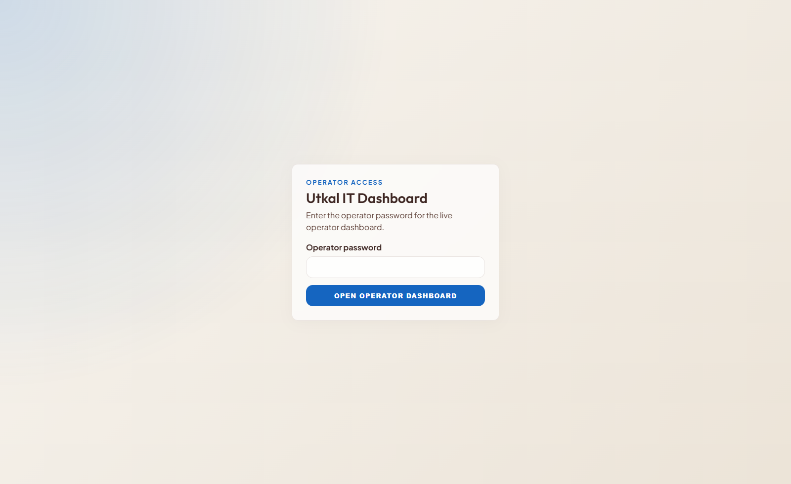
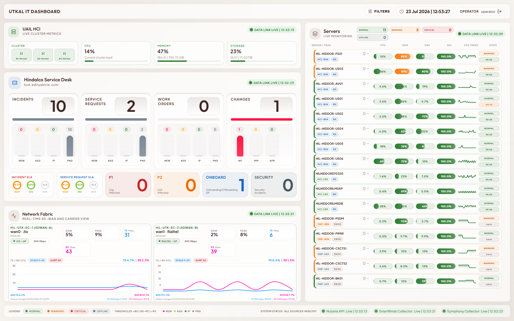
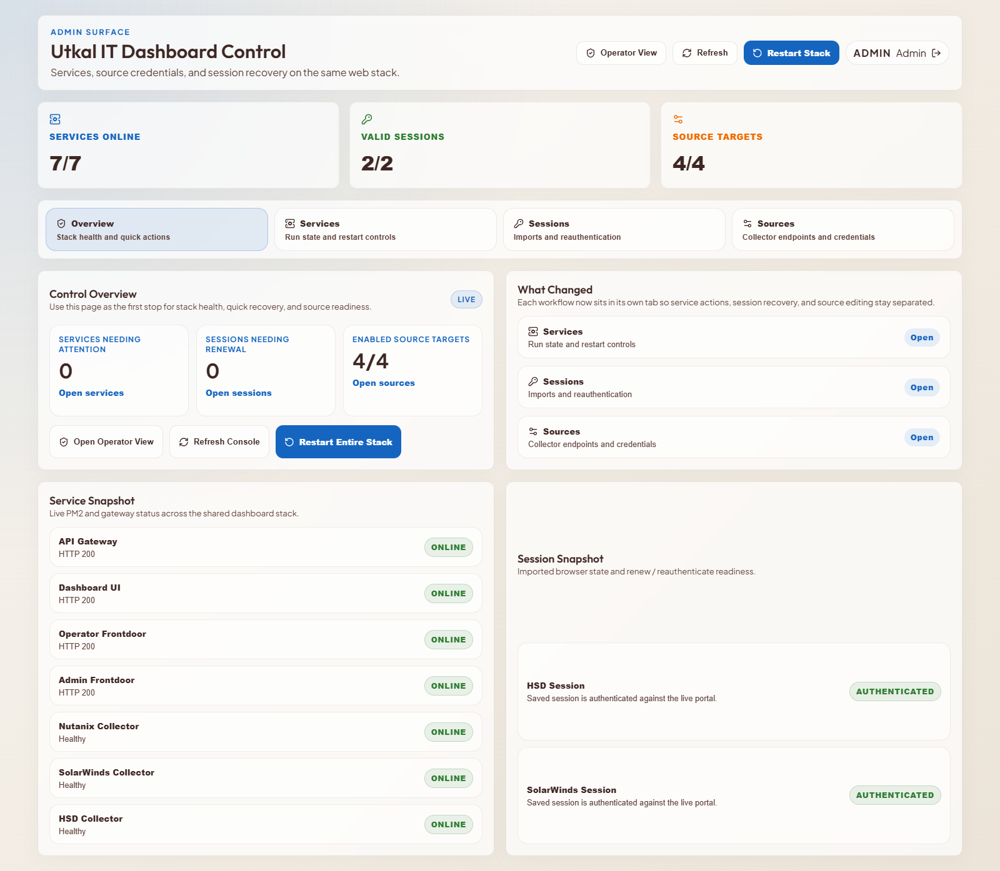
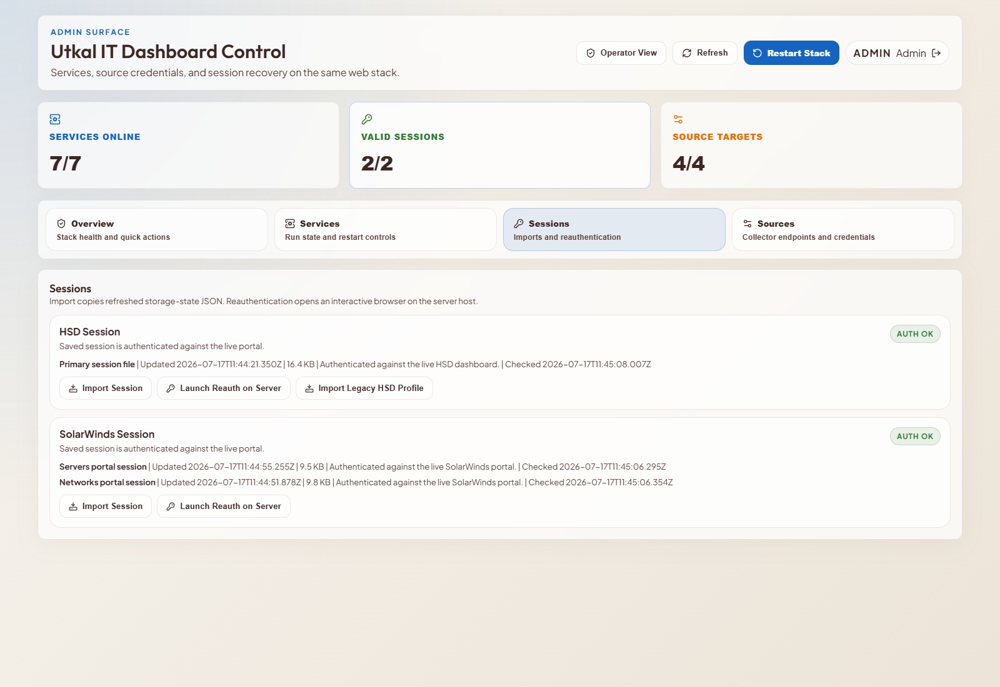

# User Manual

| Field | Value |
| --- | --- |
| Document ID | UAIL-ITDASH-UM-001 |
| Version | 1.1 |
| Status | Active baseline |
| Classification | Internal |
| Owner | Tech-Unit IT |
| Last Updated | 2026-07-19 |
| Audience | Operators, admins, support users |

## 1. Purpose
Provide practical usage guidance for the operator wallboard and the admin console, including login, interpretation, filters, recovery actions, and use of the documentation Help area.

## 2. Access

| Surface | URL Pattern | Intended User |
| --- | --- | --- |
| Operator | `http://<server>:21060/login` | Operations viewers |
| Admin | `http://<server>:21061/login` | Administrators |

The operator page asks only for the operator password.  
The admin page asks only for the admin password.

## 3. Operator Login

Steps:
1. Open the operator surface in a browser.
2. Enter the operator password.
3. Confirm that the wallboard loads with live cards and the filter bar.

## 4. Operator Dashboard

The operator dashboard is organized into four major domains:
- HCI cluster metrics
- HSD backlog and SLA metrics
- Network status and utilization
- Server fleet state

## 5. Reading The Dashboard

### 5.1 Data-Link Status
Each major card shows a concise data-link status.

| State | Meaning |
| --- | --- |
| `OK` | the collector is updating normally |
| `STALE` | the last success is older than expected |
| `ERROR` | the collector attempted to refresh but failed |
| `NEVER` | the section has not yet received a successful sync |

Important rule:
- if the data-link is stale or erroring, the displayed numbers are last-synced values, not guaranteed-live values

### 5.2 Color Language
- green: healthy
- amber: warning
- orange: elevated concern
- red: critical or about to miss
- slate/grey: offline or unavailable

### 5.3 HCI Section
Use HCI to see:
- cluster resource posture
- node health
- threshold-based utilization bars

### 5.4 HSD Section
Use HSD to see:
- open work item totals
- backlog mix across `new`, `assigned`, `in progress`, and `pending`
- SLA posture
- P1, P2, onboarding, and security work pressure

### 5.5 Network Section
Use Network to see:
- link state for carriers and SDWAN paths
- current Tx/Rx values
- sparkline history and utilization trend

### 5.6 Server Section
Use Servers to see:
- HCI VM versus on-prem grouping
- Windows versus Linux grouping
- normal, warning, critical, and offline posture
- fallback or source attribution where relevant

## 6. Filters
The operator surface supports filters for:
- visible sections
- server status
- server platform
- server OS
- server source
- network carrier and path
- HSD work types and special queues

Use filters when:
- you need to isolate one domain
- you want to hide noise for a focused operational view
- you want to inspect one class of servers or one class of tickets

## 7. Mobile And Portrait Use
On narrow screens the dashboard switches to a stacked responsive layout. This is intended for monitoring and quick review, not as a replacement for the primary wallboard display.

## 8. Admin Console

The admin console provides five workflow areas:
- Overview
- Services
- Sessions
- Sources
- Help

## 9. Services Tab
Use `Services` to:
- inspect PM2-backed process health
- restart a single service
- restart the full stack when needed
- confirm health summaries and recent sync posture

Use this tab first when:
- a card is stale
- a collector appears down
- the dashboard stops updating

## 10. Sessions Tab

Use `Sessions` to validate whether HSD and SolarWinds session files are still accepted by the live portals.

Typical states:
- `AUTH OK`
- `EXPIRED`
- `UNREACHABLE`
- `MISSING`
- `INVALID`

Important:
- SolarWinds servers, SolarWinds networks, and HSD are maintained separately
- a session problem on one source does not imply the others are invalid

## 11. HSD Recovery
When HSD is expired:
1. Open the admin console on the server if possible.
2. Go to `Sessions`.
3. Launch HSD reauthentication.
4. Complete the interactive login in Edge.
5. Return to the admin console and refresh session state.

Use legacy profile import only when an older authenticated profile must be recovered deliberately.

## 12. SolarWinds Recovery
When SolarWinds session validation fails:
1. Open `Sessions`.
2. Launch the SolarWinds reauthentication helper.
3. Complete the login flow.
4. Refresh the session state and verify recovery.

## 13. Sources Tab
Use `Sources` to manage:
- enable or disable state
- target URLs
- usernames and passwords
- poll intervals
- source-specific metadata such as monitored servers or network object IDs

Save source changes before expecting the new values to take effect.

Credential model:
- Nutanix credentials are configured independently
- SolarWinds 45 and SolarWinds 46 credentials are configured independently
- HSD credentials are configured independently

## 14. Help Tab
The `Help` tab exposes the maintained PDF documentation set directly inside the admin console.

Use it for:
- viewing the PRD
- reviewing project history and timeline
- checking system design details
- opening the user manual
- opening the developer handbook

## 15. Troubleshooting Guide

### 15.1 A Dashboard Card Looks Wrong
1. Check the card data-link status.
2. If stale or erroring, treat it as last-synced.
3. If healthy but abnormal, treat it as a live operational condition.
4. Escalate to admin review if needed.

### 15.2 A Collector Is Not Updating
1. Check `Services`.
2. Check `Sessions`.
3. Check `Sources`.
4. Restart the affected service only after confirming the probable cause.

### 15.3 Credentials Were Changed
1. Update the values in `Sources`.
2. Save changes.
3. Restart the affected collector if necessary.
4. Verify the next successful sync.

## 16. Operational Dos And Don'ts

Do:
- use the data-link state to judge freshness
- use filters to simplify the wallboard view
- use admin Help for the latest internal documentation

Do not:
- assume a visible number is live if the card is stale
- expose internal ports `3001` or `4000`
- use legacy HSD import as a normal daily path
