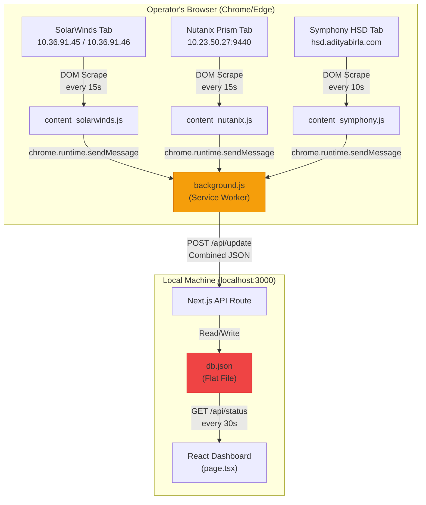
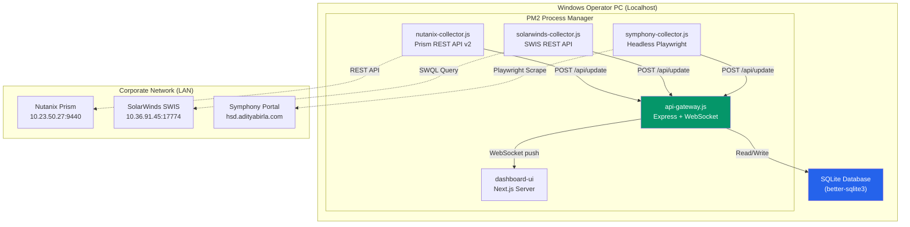

# Utkal Alumina IT Dashboard — Complete System Blueprint & Microservice Migration Plan

> **Purpose**: This document is a self-contained, portable reference that captures everything about the current IT Dashboard application and provides an exhaustive plan to rebuild it as a LAN-hosted microservice application using direct API/network programming — eliminating all browser scraping dependencies.

---

## Table of Contents

1. [Current Application Overview](#1-current-application-overview)
2. [Intended Users & Objectives](#2-intended-users--objectives)
3. [Current Architecture: Browser Scraping Model](#3-current-architecture-browser-scraping-model)
4. [Data Model & Interfaces](#4-data-model--interfaces)
5. [UI Components Breakdown](#5-ui-components-breakdown)
6. [Backend Services & API Routes](#6-backend-services--api-routes)
7. [Browser Extension Scrapers](#7-browser-extension-scrapers)
8. [Infrastructure & Source Systems](#8-infrastructure--source-systems)
9. [Limitations of Current Architecture](#9-limitations-of-current-architecture)
10. [Target Architecture: Microservice Model](#10-target-architecture-microservice-model)
11. [Direct API Integration Plan](#11-direct-api-integration-plan)
12. [Microservice Definitions](#12-microservice-definitions)
13. [Database & Storage Strategy](#13-database--storage-strategy)
14. [Real-Time Communication Layer](#14-real-time-communication-layer)
15. [LAN Deployment & Docker Compose](#15-lan-deployment--docker-compose)
16. [Security & Credential Management](#16-security--credential-management)
17. [Technology Stack Summary](#17-technology-stack-summary)
18. [Implementation Roadmap](#18-implementation-roadmap)

---

## 1. Current Application Overview

**Name**: Utkal Alumina IT Dashboard (NOC Widescreen Console)
**Location**: Hindalco Industries — Utkal Alumina International Ltd, Doraguda, Odisha
**Current Stack**: Next.js 16.2.6, React 19.2.4, TypeScript, Recharts, Lucide React, Chrome Extension (Manifest V3)

The application is an enterprise IT infrastructure monitoring dashboard designed for a NOC widescreen wall display. It aggregates, normalizes, and visualizes real-time metrics from three corporate systems:

| System | Purpose | Current Access Method |
|---|---|---|
| **Nutanix Prism Element** | HCI cluster health, VM states, storage | Chrome Extension DOM scraping |
| **SolarWinds Orion** | Server CPU/RAM, network link utilization | Chrome Extension DOM scraping |
| **Symphony SDE (HSD)** | IT service desk tickets, SLA tracking | Chrome Extension DOM scraping |

---

## 2. Intended Users & Objectives

### Primary Users
- **IT Operations Team** at Utkal Alumina — 3-5 operators monitoring the NOC console
- **IT Manager** — periodic review of infrastructure health KPIs

### Objectives
1. **Single pane of glass** for all IT infrastructure across the plant
2. **Real-time alerting** with color-coded thresholds (80% = yellow, 90% = red)
3. **Zero manual data entry** — all metrics pulled automatically
4. **Widescreen optimized** — designed for 16:9 NOC wall-mounted displays
5. **Minimal latency** — data refreshes every 15-30 seconds

---

## 3. Current Architecture: Browser Scraping Model



### Data Flow Summary
1. Chrome Extension content scripts are **injected into each portal tab** automatically via `manifest.json` match patterns
2. Each scraper parses the DOM every 10-15 seconds, extracting structured metrics
3. Data is sent to `background.js` via `chrome.runtime.sendMessage`
4. `background.js` accumulates all 3 payloads into a `combinedData` object
5. On any update, it POSTs the entire combined payload to `http://localhost:3000/api/update`
6. The Next.js API validates, rounds to 2 decimal places, and merges into `db.json` using null-coalescing patterns to avoid cross-tab data overwrites
7. The React dashboard polls `GET /api/status` every 30 seconds

---

## 4. Data Model & Interfaces

### ServerData (16 servers monitored)
```typescript
interface ServerData {
  id: string;                    // e.g., 'sw-srv-1'
  name: string;                  // e.g., 'HIL-HIDDOR-AV01.abgplanet.abg.com'
  location: string;              // 'Utkal DC'
  status: 'operational' | 'degraded' | 'down';
  cpu: number | null;            // CPU utilization %
  memory: number | null;         // RAM utilization %
  disk: number | string | null;  // Disk usage % or 'N/A'
  backupStatus: 'successful' | 'failed' | 'N/A';
  history: number[];             // Rolling 20-element CPU history
}
```

### NetworkData (4 links monitored)
```typescript
interface NetworkData {
  id: string;           // e.g., 'sw-net-1'
  provider: string;     // 'RJIO', 'RailTel', 'HIL-UTK-EC-1', 'HIL-UTK-EC-2'
  status: 'operational' | 'degraded' | 'down';
  uptime: number;       // Uptime %
  latency: number;      // Response time ms
  utilization: number;  // Bandwidth utilization %
  history: number[];    // Rolling 20-element utilization history
}
```

### NutanixMetrics
```typescript
interface NutanixMetrics {
  uptime: string;
  nodesCount: number;
  storageUsage: number;          // Cluster storage %
  historyCpu: number[];          // Rolling 20-element
  historyMem: number[];          // Rolling 20-element
  nodeStatuses?: string[];       // ['normal', 'normal', 'normal']
  vmHealth?: { good: number; warning: number; critical: number };
}
```

### SymphonyMetrics
```typescript
interface SymphonyMetrics {
  openIncidents: number;
  openIncidentsBreakdown: TicketBreakdown;  // { new, assigned, inProgress, pending }
  serviceRequests: number;
  serviceRequestsBreakdown: TicketBreakdown;
  workOrders: number;
  workOrdersBreakdown: TicketBreakdown;
  changeRecords: number;
  changeRecordsBreakdown: TicketBreakdown;
  serviceRequestsSla: number;               // Response SLA %
  incidentsResponseSla: number;
  incidentsResolutionSla: number;
  requestsResponseSla: number;
  requestsResolutionSla: number;
  activeIncidents: ActiveIncident[];
}
```

### Complete Server Inventory (16 Nodes)

| # | Server Name | Type | Sources |
|---|---|---|---|
| 1 | HIL-HIDDOR-AV01.abgplanet.abg.com | Windows | SolarWinds (CPU/RAM) + Nutanix (Disk/Backup) |
| 2 | HIL-HIDDOR-BK01 | Linux | SolarWinds |
| 3 | HIL-HIDDOR-CSCTS1 | Linux | SolarWinds |
| 4 | HIL-HIDDOR-CSCTS2 | Linux | SolarWinds |
| 5 | HILHIDDORDT0320 | Linux | Nutanix (Disk/Backup) |
| 6 | HIL-HIDDOR-FS01.abgplanet.abg.com | Windows | Both |
| 7 | HILHIDDORILMSAP | Linux | Both |
| 8 | HILHIDDORILMSDB | Linux | Both |
| 9 | HIL-HIDDOR-PIMW.abgplanet.abg.com | Windows | SolarWinds |
| 10 | HIL-HIDDOR-PSDM.abgplanet.abg.com | Windows | SolarWinds |
| 11-16 | HIL-HIDDOR-US01 through US06 | Windows | Both |

### Network Inventory (4 Links)

| Link | Type | SolarWinds Node ID |
|---|---|---|
| RJIO (ISP1) | Internet Service Provider | N:1419 |
| RailTel (ISP2) | Internet Service Provider | N:1417 |
| HIL-UTK-EC-1 (SDWAN-A) | SD-WAN Gateway | N:401 |
| HIL-UTK-EC-2 (SDWAN-B) | SD-WAN Gateway | N:402 |

---

## 5. UI Components Breakdown

### Dashboard Layout (page.tsx — 908 lines)
```
┌───────────────────────────────────────────────────────────────────┐
│  HEADER: Title | 30s Sync Badge | Last Sync Time | Analog Clock  │
├───────────┬───────────┬───────────────────────────────────────────┤
│ HCI Health│ Integrations│ System Health Status                    │
│ Card      │ 3/3 Active │ (operational/degraded/down)             │
├───────────┴───────────┴───────────────────────────────────────────┤
│                                     │                             │
│  Hindalco Service Desk              │  Utkal Alumina Server Nodes │
│  ┌─────┬──────┬─────┬────────┐      │  ┌─────────────────────────┐│
│  │Inc  │ SR   │ WO  │ CR     │      │  │ Windows Servers (10)    ││
│  │ 2   │  5   │  0  │  1     │      │  │ CPU | RAM | Disk |Backup││
│  │[bar]│[bar] │[bar]│ [bar]  │      │  │ ──────────────────────  ││
│  │New  │ New  │New  │ New    │      │  │ Linux Servers (6)       ││
│  │Asgn │ Asgn │Asgn │ Asgn   │      │  │ CPU | RAM | Disk |Backup││
│  │InPrg│ InPrg│InPrg│ InPrg  │      │  └─────────────────────────┘│
│  │Pend │ Pend │Pend │ Pend   │      │                             │
│  └─────┴──────┴─────┴────────┘      │                             │
│                                     │                             │
│  ISP Gateway & SDWAN Status         │                             │
│  ┌──────────────────────────┐       │                             │
│  │ Overall | Availability   │       │                             │
│  │ SDWAN-A | SDWAN-B |Links │       │                             │
│  │ ISP Performance Chart    │       │                             │
│  └──────────────────────────┘       │                             │
├─────────────────────────────────────┴─────────────────────────────┤
│  FOOTER: NOC Feed | Source Badges (Symphony/Nutanix/SolarWinds)   │
└───────────────────────────────────────────────────────────────────┘
```

### Component Inventory

| Component | File | Lines | Purpose |
|---|---|---|---|
| Main Dashboard | `src/app/page.tsx` | 908 | Entire NOC console with all sections |
| Network Card | `src/components/UnifiedNetworkCard.tsx` | 255 | SDWAN HA + ISP trend chart with Orion-style legend |
| Uptime Chart | `src/components/UptimeChart.tsx` | 76 | Reusable Recharts AreaChart (Rx/Tx) |

### Design System (globals.css)
- **Theme**: Warm clay/bronze palette (background `#f6f3ee`, primary `#8d6e63`)
- **Fonts**: Outfit (headings), Plus Jakarta Sans (body)
- **Effects**: Glassmorphism panels, animated pulse dots, hover lift transitions

---

## 6. Backend Services & API Routes

| Route | Method | Purpose |
|---|---|---|
| `/api/status` | GET | Returns entire DbSchema (all metrics) |
| `/api/status` | POST | Save/update system configuration |
| `/api/update` | POST | Receive scraped data, validate, merge into db.json |

### Key Backend Logic
- **`round2()`** helper for consistent 2-decimal formatting
- **Null-coalescing persistence**: When a scraper sends `null` for a field (e.g., CPU from Nutanix), the backend preserves the existing value from SolarWinds
- **Sliding window history**: `[...history.slice(1), newValue]` maintains 20-element arrays for sparklines
- **FQDN resolver**: Case-insensitive, suffix-agnostic server name matching

---

## 7. Browser Extension Scrapers

### content_solarwinds.js (261 lines)
- **Server scraping**: Parses `table.NeedsZebraStripes` for CPU/Memory percentages
- **Network scraping**: Reads interface utilization tables (Rx/Tx)
- **Single node pages**: Extracts status, latency, utilization from `NodeDetails.aspx`
- **Auto-login**: Fills credentials from `/api/status` configs
- **Keep-alive**: Emulates mouse/keyboard events every 60s

### content_nutanix.js (207 lines)
- **Cluster stats**: Targets `.lblTitle` + `.lblValue` for CPU/Memory/Storage percentages
- **VM table**: Parses `table.dataTable tbody tr` for disk usage (converts GiB/TiB to percentages)
- **Backup status**: Reads column 13 ("Backup and Recovery Capable")
- **VM health**: Reads On/Off counts from `.n-vantage-point-summary-vm`
- **Node health**: Reads `.count-box-*` elements for host statuses

### content_symphony.js (234 lines)
- **Geometric DOM parsing**: Uses bounding rectangle coordinates to spatially match ticket numbers to column headers
- **SVG chart text extraction**: Reads values from within chart SVG elements
- **Angular binding fallback**: Also tries `[ng-bind="CR.MyWorkgroupCount"]` selectors
- **SLA extraction**: Parses `num/den` fraction strings near SLA labels

---

## 8. Infrastructure & Source Systems

### Network Topology

| Device/System | IP Address | Port | Protocol |
|---|---|---|---|
| **Nutanix Prism Element** | 10.23.50.27 | 9440 | HTTPS |
| **SolarWinds Orion (Servers)** | 10.36.91.45 | 80/443 | HTTP/HTTPS |
| **SolarWinds Orion (Networks)** | 10.36.91.46 | 80/443 | HTTP/HTTPS |
| **Symphony HSD** | hsd.adityabirla.com | 443 | HTTPS |
| **SDWAN-A (EC-1)** | SolarWinds Node N:401 | — | Monitored via SolarWinds |
| **SDWAN-B (EC-2)** | SolarWinds Node N:402 | — | Monitored via SolarWinds |
| **RJIO ISP** | SolarWinds Node N:1419 | — | Monitored via SolarWinds |
| **RailTel ISP** | SolarWinds Node N:1417 | — | Monitored via SolarWinds |

### Credentials (from .env)
```
SOLARWINDS_USER=hil-dor.itdashboard@adityabirla.com
SOLARWINDS_PASSWORD=ItDa$(1857
NUTANIX_USER=hildoritdashboard
NUTANIX_PASSWORD=ItDa$(1857
```

---

## 9. Limitations of Current Architecture

| Problem | Impact | Severity |
|---|---|---|
| **Browser dependency** | Requires Chrome/Edge open with 7+ tabs | 🔴 Critical |
| **Session timeouts** | Portal sessions expire, breaking data flow | 🔴 Critical |
| **Flat-file DB** | No concurrency, no history, single-writer | 🟡 Medium |
| **No resilience** | If browser closes, all data collection stops | 🔴 Critical |
| **DOM fragility** | Any portal UI update breaks scrapers | 🟡 Medium |
| **Single machine** | Dashboard only accessible on the operator's PC | 🟡 Medium |
| **Plaintext credentials** | Passwords in `.env` and `db.json` | 🟡 Medium |
| **No historical data** | Only last 20 data points in rolling arrays | 🟡 Medium |

---

## 10. Target Architecture: PM2 Multi-Process Model



### Key Architectural Decisions

| Decision | Choice | Rationale |
|---|---|---|
| **API communication** | Direct REST APIs | Eliminates browser dependency entirely |
| **Process Manager** | PM2 | Lightweight Windows background process execution. Replaces Docker. |
| **Database** | SQLite | Zero-ops for single-node LAN deployment |
| **Data Ingestion** | HTTP POST to API Gateway | Reuses existing update logic, completely removes need for Redis |
| **Real-time updates** | WebSocket (ws) | Bidirectional, already proven in current stack |
| **Frontend** | Next.js | Reuse existing UI components |

---

## 11. Direct API Integration Plan

### 11.1 Nutanix Prism REST API v2

**Base URL**: `https://10.23.50.27:9440/PrismGateway/services/rest/v2.0/`
**Auth**: HTTP Basic Auth (`hildoritdashboard:ItDa$(1857`)

| Current Scraping Target | API Replacement |
|---|---|
| Cluster CPU (`.lblValue`) | `GET /clusters/{id}/stats?metrics=hypervisor_cpu_usage_ppm` |
| Cluster Memory (`.lblValue`) | `GET /clusters/{id}/stats?metrics=hypervisor_memory_usage_ppm` |
| Cluster Storage (bar width) | `GET /clusters/{id}/stats?metrics=storage.usage_bytes,storage.capacity_bytes` |
| VM On/Off counts | `POST /vms/list` → filter by `power_state` |
| VM disk usage | `GET /vms/{uuid}/stats` or parse `disk_capacity_bytes` from VM entity |
| Host node statuses | `GET /hosts/` → check `state` field |
| Backup status | `GET /vms/` → check `protection_domain_name` or backup metadata |

```typescript
// Example: Fetch cluster CPU/Memory/Storage
const auth = Buffer.from('hildoritdashboard:ItDa$(1857').toString('base64');

async function getClusterStats() {
  const res = await fetch(
    'https://10.23.50.27:9440/PrismGateway/services/rest/v2.0/cluster/',
    {
      headers: { 'Authorization': `Basic ${auth}` },
      // Self-signed cert handling
    }
  );
  const data = await res.json();
  return {
    cpu: data.stats?.hypervisor_cpu_usage_ppm / 10000,  // ppm → %
    mem: data.stats?.hypervisor_memory_usage_ppm / 10000,
    storage: (data.usage_stats?.['storage.usage_bytes'] / 
              data.usage_stats?.['storage.capacity_bytes']) * 100,
  };
}
```

### 11.2 SolarWinds Headless Scraper

**Endpoint**: `http://10.36.91.45/Orion/` and `http://10.36.91.46/Orion/`
**Access**: DOM Scraping via Headless Browser

> [!IMPORTANT]
> The SolarWinds SWIS API ports (17778/17774) are blocked by the firewall/VPN. We can only access the web portal over port 80/443. Therefore, we must use a headless browser (Playwright) to scrape the metrics, completely reusing the DOM parsing logic from the old Chrome extension.

**Implementation (Headless Browser)**:
```typescript
import { chromium } from 'playwright';

async function scrapeSolarWinds() {
  const browser = await chromium.launch({ headless: true });
  
  // 1. Scrape Server Node Data
  const serverPage = await browser.newPage();
  await serverPage.goto('http://10.36.91.45/Orion/NetPerfMon/NodeDetails.aspx?NetObject=N:xxx');
  // Reuse content_solarwinds.js logic for CPUs/Memory
  
  // 2. Scrape Network Gateway Data
  const netPage = await browser.newPage();
  await netPage.goto('http://10.36.91.46/Orion/...');
  // Reuse content_solarwinds.js logic for Utilization
}
```

### 11.3 Symphony SDE Headless Scraper

**Endpoint**: `https://hsd.adityabirla.com/MDLIncidentMgmt/SDE_Dashboard.aspx`
**Access**: DOM Scraping via Headless Browser

> [!IMPORTANT]
> SymphonyAI Summit API access is NOT available. We must use a headless browser (Playwright or Puppeteer) running inside a Docker container to scrape the portal. This replaces the Chrome Extension but reuses its parsing logic.

**Implementation (Headless Browser)**:
```typescript
import { chromium } from 'playwright';

async function scrapeSymphony() {
  const browser = await chromium.launch({ headless: true });
  const page = await browser.newPage();
  await page.goto('https://hsd.adityabirla.com/MDLIncidentMgmt/SDE_Dashboard.aspx');
  // Login automation + DOM parsing (reuse existing content_symphony.js logic)
}
```


---

## 12. Microservice Definitions

### Script 1: `nutanix-collector.js`
- **Purpose**: Poll Nutanix Prism REST API every 30s
- **Collects**: Cluster CPU/Memory/Storage, VM list (On/Off), Host statuses, VM disk/backup
- **Publishes**: POST to `http://localhost:4000/api/update`
- **Language**: Node.js/TypeScript
- **Dependencies**: `node-fetch` or native `fetch`

### Script 2: `solarwinds-collector.js`
- **Purpose**: Headless browser scraper (running every 30s)
- **Collects**: Server CPU/RAM/Status, Network node response times, Interface utilization
- **Publishes**: POST to `http://localhost:4000/api/update`
- **Language**: Node.js/TypeScript
- **Dependencies**: `playwright`

### Script 3: `symphony-collector.js`
- **Purpose**: Headless browser scraper (running every 60s)
- **Collects**: Incident/SR/WO/CR counts and breakdowns, SLA percentages
- **Publishes**: POST to `http://localhost:4000/api/update`
- **Language**: Node.js/TypeScript
- **Dependencies**: `playwright`

### Service 4: `api-gateway.js`
- **Purpose**: Central REST + WebSocket API server
- **Responsibilities**:
  - Expose `POST /api/update` (called by collectors)
  - Merge incoming data into SQLite database (with sliding window history)
  - Serve `GET /api/status` for full dashboard state
  - Push real-time updates to connected WebSocket clients
- **Language**: Node.js/TypeScript (Express)
- **Dependencies**: `ws`, `better-sqlite3`

### Service 5: `dashboard-ui`
- **Purpose**: NOC widescreen React frontend
- **Reuse**: Port existing `page.tsx`, `UnifiedNetworkCard.tsx`, `UptimeChart.tsx`, `globals.css`
- **Connection**: WebSocket to `api-gateway` for real-time updates (replaces polling)
- **Language**: React + TypeScript (Vite or Next.js)

---

## 13. Database & Storage Strategy

### Recommended: SQLite → PostgreSQL Migration Path

**Phase 1 (Launch)**: SQLite via `better-sqlite3`
- Zero configuration, single-file database
- Perfect for single LAN server with <10 concurrent users
- Schema:

```sql
CREATE TABLE metrics_history (
  id INTEGER PRIMARY KEY AUTOINCREMENT,
  source TEXT NOT NULL,        -- 'nutanix', 'solarwinds', 'symphony'
  metric_type TEXT NOT NULL,   -- 'cluster_cpu', 'server_cpu', 'incidents', etc.
  entity_id TEXT,              -- Server name or network ID
  value REAL,
  timestamp DATETIME DEFAULT CURRENT_TIMESTAMP
);

CREATE TABLE servers (
  id TEXT PRIMARY KEY,
  name TEXT NOT NULL,
  location TEXT DEFAULT 'Utkal DC',
  status TEXT DEFAULT 'operational',
  cpu REAL, memory REAL, disk REAL,
  backup_status TEXT DEFAULT 'N/A',
  updated_at DATETIME
);

CREATE TABLE networks (
  id TEXT PRIMARY KEY,
  provider TEXT NOT NULL,
  status TEXT DEFAULT 'operational',
  latency REAL, utilization REAL,
  updated_at DATETIME
);

CREATE TABLE nutanix_cluster (
  id INTEGER PRIMARY KEY,
  cpu REAL, memory REAL, storage REAL,
  nodes_count INTEGER,
  vm_on INTEGER, vm_off INTEGER,
  updated_at DATETIME
);

CREATE TABLE symphony_tickets (
  id INTEGER PRIMARY KEY,
  incidents INTEGER, service_requests INTEGER,
  work_orders INTEGER, change_records INTEGER,
  incidents_response_sla REAL,
  incidents_resolution_sla REAL,
  requests_response_sla REAL,
  requests_resolution_sla REAL,
  updated_at DATETIME
);

CREATE TABLE configs (
  system TEXT PRIMARY KEY,
  endpoint TEXT, username TEXT, auth_method TEXT,
  secret_encrypted TEXT,
  connected BOOLEAN DEFAULT FALSE
);
```

**Phase 2 (Scale)**: Migrate to PostgreSQL when needed (multi-node, replication, `LISTEN/NOTIFY`)

---

## 14. Real-Time Communication Layer

By removing Redis, we simplify the architecture. Collectors simply POST data to the API Gateway. The API Gateway then writes to SQLite and broadcasts the update to the frontend via WebSockets.

### API Gateway Data Ingestion
Collectors send payloads identically to the old Chrome extensions:
```typescript
await fetch('http://localhost:4000/api/update', {
  method: 'POST',
  body: JSON.stringify({ nutanix: { /* stats */ } })
});
```

### WebSocket Protocol (api-gateway → dashboard-ui)

```typescript
// Server sends on any metric update:
{
  type: 'METRIC_UPDATE',
  source: 'nutanix' | 'solarwinds' | 'symphony',
  data: { /* merged DbSchema */ },
  timestamp: '2026-07-11T15:30:00Z'
}

// Client can request full state:
{ type: 'REQUEST_FULL_STATE' }
// Server responds:
{ type: 'FULL_STATE', data: { /* entire DbSchema */ } }
```

---

## 15. Windows PM2 Deployment (Zero Docker)

Instead of Docker Compose, we define a single `ecosystem.config.js` file for PM2.

```javascript
module.exports = {
  apps: [
    {
      name: 'api-gateway',
      script: './api-gateway/dist/index.js',
      env: { DB_PATH: './data/itdash.db', PORT: 4000 }
    },
    {
      name: 'nutanix-collector',
      script: './collectors/nutanix/dist/index.js',
      env: { API_URL: 'http://localhost:4000/api/update' }
    },
    {
      name: 'solarwinds-collector',
      script: './collectors/solarwinds/dist/index.js',
      env: { API_URL: 'http://localhost:4000/api/update' }
    },
    {
      name: 'symphony-collector',
      script: './collectors/symphony/dist/index.js',
      env: { API_URL: 'http://localhost:4000/api/update' }
    },
    {
      name: 'dashboard-ui',
      script: 'npm',
      args: 'start',
      cwd: './dashboard',
      env: { NEXT_PUBLIC_API_URL: 'http://localhost:4000' }
    }
  ]
};
```

**To Start the Entire System:**
```bash
npm install -g pm2
pm2 start ecosystem.config.js
pm2 save
pm2 startup  # Configures Windows to auto-start on boot
```

### Directory Structure for New Workspace

```
utkal-it-dashboard/
├── ecosystem.config.js
├── .env                       # Environment variables / Credentials
├── collectors/
│   ├── nutanix/
│   │   ├── package.json
│   │   └── src/index.ts       # Polling loop & REST API client
│   ├── solarwinds/
│   │   ├── package.json
│   │   └── src/index.ts       # Headless Playwright script
│   └── symphony/
│       ├── package.json
│       └── src/index.ts       # Headless Playwright script
├── api-gateway/
│   ├── package.json
│   └── src/
│       ├── index.ts           # Express server & WebSocket
│       ├── db.ts              # SQLite queries
│       └── routes/update.ts
└── dashboard/
    ├── package.json
    └── src/
        ├── app/               # Next.js pages
        └── components/
```

---

## 16. Security & Credential Management

| Current (Insecure) | Target (Secure) |
|---|---|
| Plaintext passwords in `.env` | `.env` variables injected via PM2 `ecosystem.config.js` |
| Credentials in `db.json` | Encrypted at rest in SQLite with `AES-256` |
| No auth on dashboard | Optional: Basic Auth or Active Directory SSO |
| HTTP localhost only | HTTPS with self-signed cert (internal LAN) |
| No audit trail | Structured logging with timestamps |

---

## 17. Technology Stack Summary

| Layer | Current | Target |
|---|---|---|
| **Frontend** | Next.js 16 + React 19 | Same (or Vite React for lighter build) |
| **Charts** | Recharts | Same |
| **Icons** | Lucide React | Same |
| **Styling** | Vanilla CSS | Same |
| **API Server** | Next.js API Routes | Express/Fastify standalone |
| **Database** | JSON flat file | SQLite → PostgreSQL |
| **Message Broker** | None | Removed (Not required) |
| **Real-time** | HTTP polling (30s) | WebSocket push |
| **Data Collection** | Chrome Extension DOM scraping | Node.js PM2 Scripts (APIs + Headless Playwright) |
| **Nutanix** | DOM parsing | Prism REST API v2 |
| **SolarWinds** | DOM parsing | Headless Playwright |
| **Symphony** | Geometric DOM parsing | Headless Playwright |
| **Deployment** | localhost only | **Windows PM2 Ecosystem** |
| **Credentials** | Plaintext `.env` | Local `.env` |

### npm Packages for New Workspace

```bash
# PM2 (Global)
npm install -g pm2

# Shared / Collectors
npm install typescript tsx node-fetch

# Playwright Scrapers (SolarWinds & Symphony)
npm install playwright

# api-gateway
npm install express cors ws better-sqlite3

# dashboard
npm install next react react-dom recharts lucide-react
```

---

## 18. Implementation Roadmap

### Phase 1: Foundation (Week 1-2)
- [ ] Set up Workspace and `ecosystem.config.js`
- [ ] Build `api-gateway` with SQLite, POST `/api/update` endpoint, and WebSocket server
- [ ] Port dashboard UI components (page.tsx, UnifiedNetworkCard, UptimeChart)
- [ ] Replace HTTP polling with WebSocket hook in frontend

### Phase 2: Nutanix Integration (Week 2-3)
- [ ] Build `nutanix-collector` service
- [ ] Implement Prism REST API v2 client (cluster stats, VM list, hosts)
- [ ] Validate data parity with current scraper output
- [ ] Test self-signed certificate handling

### Phase 3: SolarWinds Integration (Week 3-4)
- [ ] Build `solarwinds-collector` service
- [ ] Implement SWIS SWQL client (server nodes, network interfaces)
- [ ] Map existing 16 servers + 4 network links
- [ ] Validate utilization/latency data accuracy

### Phase 4: Symphony Integration (Week 4-5)
- [ ] Request REST API access from Hindalco IT
- [ ] If available: Build `symphony-collector` with REST client
- [ ] If unavailable: Build headless Playwright scraper as Docker service
- [ ] Validate ticket counts and SLA percentages

### Phase 5: Hardening & Deployment (Week 5-6)
- [ ] Implement `pm2-logrotate` for log management
- [ ] Configure `pm2 startup` for Windows auto-boot recovery
- [ ] Performance testing with NOC widescreen display
- [ ] Documentation and operator training

> [!IMPORTANT]
> **Before starting Phase 2**, confirm the Nutanix Prism REST API is accessible by running a test `curl` command from the LAN server:
> ```bash
> curl -k -u hildoritdashboard:password https://10.23.50.27:9440/PrismGateway/services/rest/v2.0/cluster/
> ```
> Similarly, test SolarWinds SWIS access before Phase 3.

---

> **This document is designed to be fully portable.** Take it to a new workspace, follow the directory structure in Section 15, and begin implementation from Phase 1. All IP addresses, credentials, server inventories, data models, and API specifications are included.
